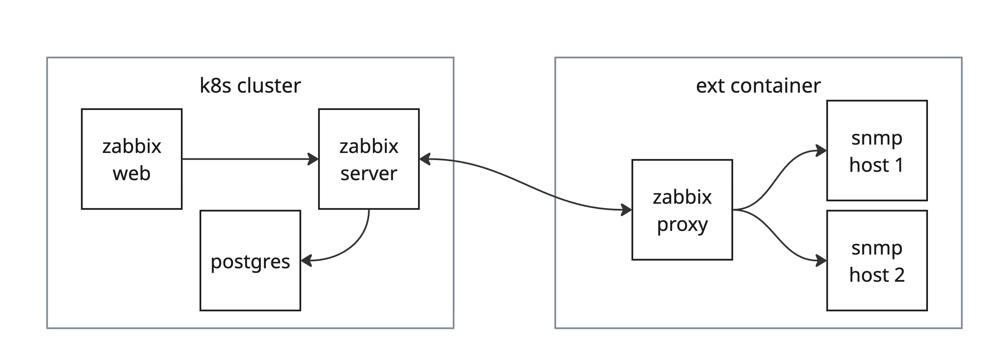
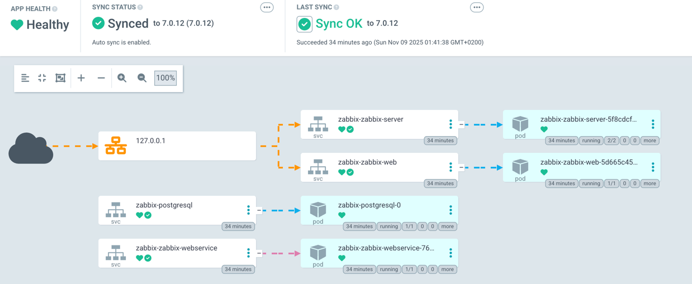
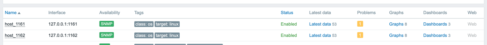
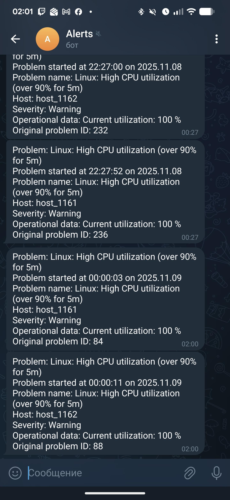

# Automated k8s setup for local testing
## Preparation
1. Install docker (https://docs.docker.com/desktop/setup/install/mac-install/)
2. Install minikube and kubectl (https://minikube.sigs.k8s.io/docs/start/?arch=%2Fmacos%2Farm64%2Fstable%2Fbinary+download)
3. Clone repo to local system
4. ```
   $ python3 -m venv local_dev_k8s
   $ source local_dev_k8s/bin/activate
   ```
5. `$ pip install -r requirements.txt`
6. `$ ansible-galaxy install -r requirements.yml`
7. In new terminal `$ minikube start`
8. `$ minikube tunnel` and enter system user password
9. In new terminal `$ docker run -d --rm --name zabbix-proxy willhallonline/ansible:2.16-ubuntu-22.04 tail -f /dev/null`
10. Get back to the python terminal and `$ export ANSIBLE_ALLOW_BROKEN_CONDITIONALS=true`
11. Create `secrets.pass` file with vault password
12. `$ ansible-playbook -i inventory/all.yaml kubernetes.yaml --vault-password-file secrets.pass`
13. `$ ansible-playbook -i inventory/all.yaml proxy.yaml`

## Architecture


## Services
### ArgoCD
> UI is available on https://localhost/ with user `admin` and password printed on playbook play.

ArgoCD installs Zabbix from manifest in https://github.com/andrejshapal/local_dev_k8s/tree/master/argocd



### Zabbix
> WEB is available on http://localhost:8080/ with creds `Admin:zabbix`.

In Zabbix we provision:
- Admin user media notification channel;
- Proxy;
- Alert action (for severity and for host group);
- Alert mediatype Telegram with bot token;
- Host group;
- SNMP host to scrape data from;



### Proxy
In docker container we run zabbix-proxy and 2 snmp mocks.

> I suspect there is a bug with pid file in zabbix-proxy role. I am lazy to fix it, but if proxy does not start from first time, it can be fixed by restarting container and launching playbook once again. 

### Telegram
> Alert channel: http://t.me/zabbix_test_as_bot


